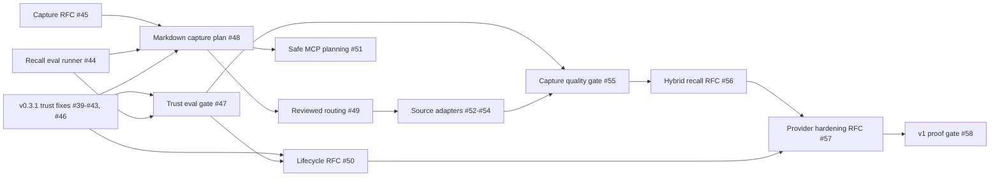

# Memzoi roadmap

Status: active
Updated: 2026-07-10
Shipped baseline: v0.3.1

## Product outcome

Memzoi should become the most trustworthy local memory provider for coding agents before it expands into hosted or team memory. Winning requires a complete, measurable loop:

```text
explicit evidence
  -> candidate formation
  -> human-reviewable routing
  -> canonical file memory
  -> trustworthy recall and precheck
  -> review-first lifecycle maintenance
  -> evaluation, recovery, and audit
```

The v0.3 release supplies a strong governed memory kernel. The roadmap closes the gap between that kernel and a complete provider.

## Current baseline

| Capability | v0.3 reality | Roadmap implication |
| --- | --- | --- |
| Canonical truth | Reviewed Markdown records are canonical; SQLite indexes and exports are disposable | Preserve this differentiator across every new feature |
| Governance | Typed proposals, explicit apply, provenance, privacy planes, and pre-action warnings exist | Close route-parity and correctness gaps before expanding writes |
| Memory formation | Import and session-end route already-structured candidates; they do not extract memories | Build evidence-backed capture from named sources |
| Retrieval | FTS5/BM25 plus scope, type, lane, confidence, and path reranking | Establish evals, then add semantic recall only if it wins measurably |
| Consolidation | Exact duplicate suppression and manual supersede/tombstone exist | Add review-first near-duplicate, contradiction, staleness, and retention planning |
| Evaluation | Fixed integration tests and latency benchmarks exist | Ship a file-native product eval runner and CI quality gates |
| Provider surface | CLI, six safe MCP tools, integrations, and deterministic exports exist | Stabilize contracts and harden operations after capture, recall, and lifecycle are proven |

Historical research under `.research/docs/` remains useful background, but current product documentation under `website/docs/`, shipped behavior, and this roadmap take precedence when they disagree. In particular, v0.3's two-plane file-native model supersedes the earlier SQLite-canonical direction.

## Roadmap principles

1. Evaluation lands before automated candidate formation.
2. Capture reads only sources explicitly named by the caller.
3. Planning does not mutate canonical, proposal, or runtime memory state.
4. Repo knowledge still follows candidate -> proposal -> review -> explicit apply.
5. Evidence provenance and proposal lineage remain distinct and auditable.
6. Embedding and graph indexes, if adopted, are derived and disposable.
7. New retrieval methods ship only when they beat the lexical baseline without safety regressions.
8. Cloud sync, team services, and graph memory do not precede a proven local loop.

## Release sequence

### v0.3.1 - Trust Contract

Outcome: every existing governance claim is true across every read and write route.

Exit criteria:

- Expired records never leak into normal recall.
- Path-bound warnings do not depend on lexical overlap.
- Original evidence survives proposal apply and rebuild.
- Every canonical apply route enforces repo-safe sensitivity.
- File-backed proposals leave a resolved, indexed, auditable state.
- Reviewed supersede and tombstone packets have lifecycle parity with create packets.

Issues:

- [#39 Recall path-bound governance memory without lexical overlap](https://github.com/Zokiio/Memzoi/issues/39)
- [#40 Honor record expiry across every read surface](https://github.com/Zokiio/Memzoi/issues/40)
- [#41 Require repo-safe sensitivity on every canonical apply route](https://github.com/Zokiio/Memzoi/issues/41)
- [#42 Preserve evidence provenance separately from proposal lineage](https://github.com/Zokiio/Memzoi/issues/42)
- [#43 Resolve and index file-backed proposal packets atomically](https://github.com/Zokiio/Memzoi/issues/43)
- [#46 Apply supersede and tombstone actions from reviewed proposal files](https://github.com/Zokiio/Memzoi/issues/46)

### v0.4 - Evidence-backed Capture

Outcome: Memzoi can form useful, reviewable memory candidates from explicit project evidence and prove the quality and safety of doing so.

Delivery order:

1. Land the recall eval runner and trust metrics.
2. Approve the capture/extractor contract.
3. Deliver one Markdown source as the end-to-end tracer bullet.
4. Add instruction-file, ADR, and Git-change sources independently.
5. Gate the release on capture quality, prohibited-data leakage, and review burden.

Exit criteria:

- A versioned, file-native corpus produces stable human and JSON reports.
- Capture planning makes no implicit memory or proposal writes.
- Every candidate cites exact source evidence and carries extractor, confidence, destination, sensitivity, and classification metadata.
- Applying a reviewed plan reuses existing destination and proposal boundaries; it never silently creates canonical repo memory.
- CI measures retrieval, precheck, provenance, capture quality, privacy leakage, latency, and review burden.
- Raw chats, hidden agent state, ambient repository scans, and automatic canonical promotion remain excluded.

Issues:

- [#44 Add a file-native `memzoi eval recall` golden suite](https://github.com/Zokiio/Memzoi/issues/44)
- [#45 RFC: Define the evidence-backed capture and extractor boundary](https://github.com/Zokiio/Memzoi/issues/45) — [RFC 0001 draft](rfcs/0001-evidence-backed-capture.md)
- [#47 Add safety and quality metrics to eval output and CI](https://github.com/Zokiio/Memzoi/issues/47)
- [#48 Plan evidence-backed capture from one explicit Markdown source](https://github.com/Zokiio/Memzoi/issues/48)
- [#49 Route a reviewed capture plan through existing memory boundaries](https://github.com/Zokiio/Memzoi/issues/49)
- [#51 Expose evidence-backed capture planning through safe MCP](https://github.com/Zokiio/Memzoi/issues/51)
- [#52 Capture explicit agent instruction files with evidence](https://github.com/Zokiio/Memzoi/issues/52)
- [#53 Capture explicit ADR sources with evidence](https://github.com/Zokiio/Memzoi/issues/53)
- [#54 Capture durable findings from an explicit Git change](https://github.com/Zokiio/Memzoi/issues/54)
- [#55 Measure capture quality and human review burden](https://github.com/Zokiio/Memzoi/issues/55)

### v0.5 - Trustworthy Hybrid Recall

Outcome: semantic retrieval is added only if it materially improves the same corpus while preserving deterministic fallback, citations, scope, lifecycle suppression, and latency.

The first deliverable is [#56 RFC: Select an eval-gated disposable hybrid recall design](https://github.com/Zokiio/Memzoi/issues/56). That decision will create thin implementation issues for the selected index adapter, semantic search tracer, explainable fusion, local/session opt-in, and competitor bakeoff. This avoids committing to a vector stack before the v0.4 evidence exists.

Exit criteria:

- The accepted hybrid method clears a documented material-improvement threshold over lexical recall.
- There is zero regression in stale, expired, scope, or private-memory leakage.
- Every result exposes lexical, semantic, fusion, and suppression signals with original citations.
- Lexical recall remains available without network, credentials, or an embedding index.
- The target hybrid p95 is below 200 ms at 10,000 records unless the eval-backed RFC revises it.

### v0.6 - Memory Quality and Lifecycle

Outcome: Memzoi can identify memory-quality problems and propose safe maintenance without silently rewriting canonical truth.

The first deliverable is [#50 RFC: Define review-first maintenance and lane retention policy](https://github.com/Zokiio/Memzoi/issues/50). It will generate implementation slices for mutation-free maintenance planning, consolidation proposals, lane-aware retention, local/session privacy operations, and lifecycle health evals.

Exit criteria:

- Maintenance planning detects near duplicates, contradictions, staleness, expiry, and renewal candidates without writes.
- Accepted repo changes use create, supersede, or tombstone proposals.
- Session state expires aggressively, episodes may decay, and durable decisions/procedures persist until reviewed or superseded.
- False consolidation, stale leakage, retention behavior, and review burden are measured.
- Local/session deletion, redaction, expiry, and export controls do not leak private content into Git artifacts.

### v0.7 - Provider Experience and Hardening

Outcome: the proven local memory loop has stable integration contracts, useful privacy-safe traces, threat defenses, and tested recovery.

The first deliverable is [#57 RFC: Define provider contracts and v1 hardening gates](https://github.com/Zokiio/Memzoi/issues/57). It will generate implementation slices for versioned contracts, safe plan-only MCP surfaces, trace export, poisoning and secret defenses, migration/recovery, and any HTTP or SDK surface justified by real integration evidence.

Exit criteria:

- CLI JSON, MCP, eval, capture-plan, maintenance-plan, and proposal contracts have compatibility policies.
- Trace and feedback data exclude raw prompts, private evidence, and secrets.
- Prompt injection, memory poisoning, provenance forgery, secret leakage, malicious files, migration, corruption, downgrade, and recovery have executable gates.
- Package and integration work is separated from memory semantics and backed by observed user demand.

### v1.0 - Proven Local Memory Provider

Outcome: the entire governed loop is demonstrated, measured, recoverable, and ready for a maintainer release decision.

Release gate: [#58 Prove the complete governed memory-provider loop for v1.0](https://github.com/Zokiio/Memzoi/issues/58).

## Dependency map



## Release metrics

| Area | Required evidence |
| --- | --- |
| Recall | recall@k, MRR/NDCG, forbidden-hit rate, scope/stale/expiry leakage, citation integrity |
| Precheck | precision/recall, path-bound warning coverage, false-positive rate, cited next steps |
| Capture | candidate precision/recall, evidence validity, destination/sensitivity accuracy, duplicate/conflict handling, prohibited-data leakage |
| Human review | proposed, accepted, rejected, edited, duplicate, and needs-review counts |
| Lifecycle | stale leakage, false consolidation, retention behavior, recovery from rejected/failed maintenance |
| Performance | lexical p95 below 50 ms and context-pack p95 below 400 ms at 10,000 records; hybrid target below 200 ms unless eval evidence changes it |
| Provider readiness | clean-install success, integration contract compatibility, migration/rebuild/recovery success, reproducible competitor bakeoff |

## Deliberately deferred

- Cloud sync, hosted team memory, ACLs, and multitenancy until the local loop is proven.
- Temporal graph or entity memory until eval evidence identifies a workload where it outperforms simpler retrieval.
- A full GUI until review burden shows that CLI, Git, and generated views are insufficient.
- HTTP and SDK work until real integrations require a service boundary beyond CLI and stdio MCP.
- Ambient scanning, raw transcript ingestion, hidden-state inspection, and silent canonical writes remain outside the governed product contract.

## Backlog policy

The roadmap is concrete through v0.4. Later milestones begin with evidence-driven RFCs and create implementation issues only after their contracts and go/no-go gates are accepted. This keeps the backlog independently grabbable and prevents speculative architecture from becoming accidental commitment.
